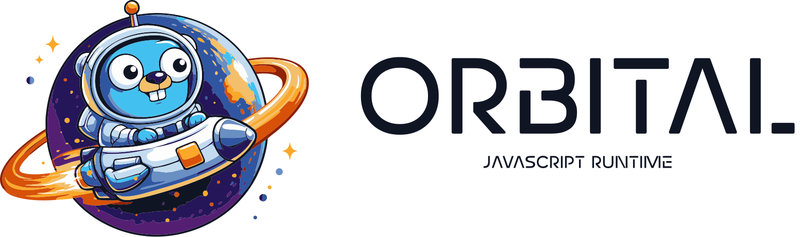

<picture>
  <source media="(prefers-color-scheme: dark)" srcset=".github/orbital-logo-dark.png">
  <source media="(prefers-color-scheme: light)" srcset=".github/orbital-logo-light.png">
  
</picture>

# Orbital

[](https://pkg.go.dev/proto.zip/studio/orbital)
[](https://github.com/proto-studio/orbital/releases)
[](https://github.com/proto-studio/orbital)

[Orbital][orbital] is a Go JavaScript runtime powered by V8. It provides Node.js-compatible APIs so you can run scripts from the CLI or embed a sandboxed JavaScript engine in a Go program — with native modules and CommonJS/ESM support.

With Orbital, creating a runtime is idiomatic Go:

```go
package main

import (
	"fmt"

	"proto.zip/studio/orbital/pkg/nodejs"
	"proto.zip/studio/orbital/pkg/runtime"
)

func main() {
	inst, err := nodejs.New(runtime.DefaultConfig())
	if err != nil {
		panic(err)
	}
	defer inst.Runtime.Dispose()

	result, err := inst.Runtime.RunScript(`console.log("Hello from Orbital!")`, "main.js")
	if err != nil {
		panic(err)
	}
	fmt.Println(result.String())
}
```

Or register individual modules from `pkg/nodejs/<module>` when you only need a subset.

## Installation

> [!TIP]
> You need Go 1.24+ and a C toolchain for CGO (`clang` on macOS, `gcc` on Linux). You do **not** need a C++ compiler: the V8 C++ bridge ships pre-compiled.

```shell
go get proto.zip/studio/orbital
```

Orbital links a prebuilt V8 static library (currently V8
<!-- V8_VERSION -->15.1.206.23<!-- /V8_VERSION -->). The libraries are **not** committed to the repository: they are published as checksum-verified GitHub Release assets and fetched on demand.

Because those libraries live in the (clearable) Go module cache after `go get`, they cannot be linked from there. A small setup tool (`cmd/v8setup`) downloads the pinned, checksum-verified libraries into a project-local `.v8/` directory. Wire it in **once**:

1. Add a helper package that runs the setup tool via `go generate` and is blank-imported from `main` so its generated link flags are in the build:

```go
// internal/v8dist/v8dist.go
//go:generate go run proto.zip/studio/orbital/cmd/v8setup -link-out .
package v8dist
```

```go
// main.go
import _ "yourmodule/internal/v8dist"
```

2. Fetch V8, then build with CGO enabled:

```shell
go generate ./...          # downloads V8 into .v8/ and writes the cgo link file
CGO_ENABLED=1 go build -o myapp .
```

3. Add `.v8/` and `**/zz_generated_v8link_*.go` to `.gitignore`.

`go build` does **not** run `go generate` automatically — run it after `go get`, after bumping Orbital, or in CI before building.

See [Installing the V8 runtime](#installing-the-v8-runtime) for cross-compilation, caching, and troubleshooting.

## CLI

```shell
make build-native          # after go generate
./build/orbital script.js
./build/orbital -e "console.log('Hello!')"
./build/orbital            # REPL
```

```shell
# Restrict filesystem to a directory
./build/orbital --root ./sandbox script.js

# Full sandbox (fake system info, blocked network)
./build/orbital -s --root ./sandbox script.js

# Network allow/deny lists
./build/orbital --allow-net=api.example.com script.js
```

Flags are documented in [`docs/cli-flags.md`](docs/cli-flags.md).

## Sandboxing

In library code, pass a `runtime.Config` with sandboxed implementations:

```go
cfg := &runtime.Config{
	Filesystem:     runtime.NewLocalFilesystem("/sandbox"),
	SystemInfo:     runtime.NewSandboxedSystemInfo(nil),
	HTTPClient:     runtime.NewFilteredHTTPClient(runtime.DenyAllPolicy()),
	ProcessSpawner: runtime.NewNoOpProcessSpawner(),
	DocumentRoot:   "/sandbox",
	Timeout:        30 * time.Second,
}
rt, err := runtime.New(cfg)
```

## Packages

| Package | Purpose |
|---------|---------|
| `pkg/v8` | Low-level V8 bindings (CGO) |
| `pkg/runtime` | JavaScript runtime, event loop, sandbox interfaces |
| `pkg/nodejs` | Node.js-compatible runtime constructor (`nodejs.New`) |
| `pkg/nodejs/*` | Individual Node.js standard library modules (`fs`, `console`, `process`, …) |
| `cmd/orbital` | CLI binary |

Orbital implements a growing subset of Node.js — CommonJS and ESM, `console`, timers, `process`, `Buffer`, `fs`, `path`, `http`, `crypto`, isolate-backed `worker_threads`, `async_hooks`, and more. See [`modules.md`](modules.md) for the full checklist and [`docs/known-limitations.md`](docs/known-limitations.md) for gaps inside implemented modules.

Not yet implemented: `cluster`, full stream piping, async iterators. `async_hooks` context does not yet cross native `await` boundaries (see [`docs/async-context.md`](docs/async-context.md)).

## Installing the V8 runtime

Prebuilt libraries are available for:

| Platform | Target |
|----------|--------|
| macOS ARM64 (Apple Silicon) | `darwin/arm64` |
| Linux ARM64 | `linux/arm64` |
| Linux x86_64 | `linux/amd64` |

> Intel macOS (`darwin/amd64`) is not supported: current V8 requires the macOS 15+ SDK, which ships only on Apple Silicon.

On a standard glibc-based Linux or macOS system, the prebuilt CLI needs no extra setup beyond the binary. Linux builds dynamically link system libraries already present on most distros (`libc`, `libstdc++`, `libatomic`, etc.).

### Cross-compiling

`go generate` respects `GOOS`/`GOARCH`, so you can install multiple targets side by side:

```shell
GOOS=linux GOARCH=arm64 go generate ./...
GOOS=linux GOARCH=arm64 CGO_ENABLED=1 CC=aarch64-linux-gnu-gcc go build -o myapp-linux-arm64 .
```

Each target gets its own `.v8/<version>/<goos>-<goarch>/` directory and its own build-tagged link file, so targets never collide.

### Layout, caching, and clearing

```
.v8/
  v0.2.4/                    # pinned module version
    linux-amd64/lib/*.a
    darwin-arm64/lib/*.a
```

- **Custom location:** set `V8_HOME=/path` to install into a shared OS user-data directory instead of the project (the generated link file then uses an absolute path; keep it gitignored).
- **CI caching:** cache the `.v8/` directory keyed on the Orbital module version to skip re-downloading on every run.
- **Clearing:** delete `.v8/` (and re-run `go generate`) to force a fresh, re-verified download.

If `go build` reports `cannot find -lv8go_glue` or `undefined reference` errors, the V8 runtime hasn't been installed for that target. Run the exact command the tool prints, e.g.:

```shell
GOOS=linux GOARCH=arm64 go generate ./...
```

### Linking model

After `go generate`, `go build` compiles only the pure-C boundary (`pkg/v8/v8go.h`) with your C compiler. `pkg/v8` itself carries **no** `-L`/`-l` flags. A generated `zz_generated_v8link_<goos>_<goarch>.go` file in your helper package supplies the link path and `-l` flags, pulling in `libv8go_glue.a`, `libv8_monolith.a`, and `libv8_libcxx.a`.

The C++ bridge (`pkg/v8/csrc/v8go.cc`) is **not** compiled by CGO. V8 is built with Chromium's custom libc++ (`std::__Cr::`), which is ABI-incompatible with the system `libstdc++` a stock `g++` would use. The bridge is therefore pre-compiled per platform into `libv8go_glue.a` with V8's own toolchain so consumers can link with a plain C toolchain.

The archives are not committed because the Go module proxy / `go get` do not run Git LFS smudge, and V8's monolith exceeds GitHub's 100MB per-file Git limit. GitHub Releases allow multi-GB assets, so the libraries are published there and fetched on demand.

## Examples

Fuller examples live in [`examples/`](examples/):

- [`examples/hellov8`](examples/hellov8) — lowest-level V8 isolate
- [`examples/native/modules`](examples/native/modules) — native Go modules callable from JS
- [`examples/native/esm`](examples/native/esm) — ES modules
- [`examples/sandbox-server`](examples/sandbox-server) — sandboxed HTTP server

## Documentation

- [Contributing](CONTRIBUTING.md) — building V8 from source, glue rebuilds, and tests
- [CLI flags](docs/cli-flags.md) — Orbital flags vs Node.js
- [Node.js module checklist](modules.md)
- [Known limitations](docs/known-limitations.md)

## Contributing

We genuinely appreciate any help! If you'd like to contribute, see the [Contributing Guidelines][contributing].

## Legal

Offered under the MIT license.

[orbital]: https://github.com/proto-studio/orbital
[contributing]: CONTRIBUTING.md
